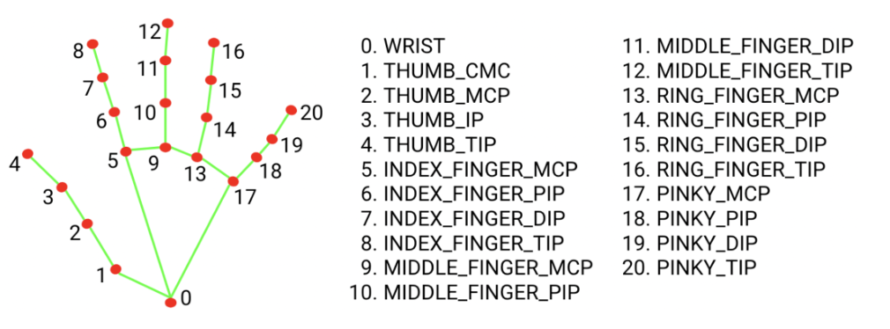

# IrisFlow — Technical Report

A system enabling cursor control via pupil tracking, and other mouse actions. Success focuses on jitter-free movement, gesture reliability. Camera is capped to 30 FPS to limit lag on the system.

## Gesture Definitions

| Gesture | Input | Implementation |
|---------|-------|----------------|
| Mouse Movement | Iris/pupil tracking | `tracker.get_gaze_ratio()` → homography → One-Euro → `pyautogui.moveTo()` |
| Left Click | Left eye wink | Blendshape differential with 500ms cooldown |
| Right Click | Right eye wink | Same mechanism, opposite eye |
| Scroll | 1 Finger (Index) | Y-axis velocity of index tip |
| Zoom | 2 Fingers (Pinch) | Euclidean distance delta between thumb & index |
| Drag | 3 Fingers | `mouseDown` while 3 fingers extended, iris controls movement |
| Switch Desktop | 4 Finger Swipe | Horizontal velocity threshold on index finger |
| Mission Control | 5 Fingers (Palm) | All fingers extended detection |

## Technical Challenges

### Mouse Control — The "Centre Snap" Problem

I had problems with letting the pupil control the mouse, since the moment you look straight at the screen, the mouse goes back to the centre. This is because the mouse position was the iris position *relative to the eye socket*:

```python
# Left Eye (33=outer, 133=inner, 159=top, 145=bottom)
# Right Eye (362=inner, 263=outer, 386=top, 374=bottom)
l_iris, r_iris = marks[468], marks[473]

# Horizontal ratio (0.0 = looking left, 1.0 = looking right)
l_h = (l_iris.x - marks[33].x) / (marks[133].x - marks[33].x + eps)
r_h = (r_iris.x - marks[362].x) / (marks[263].x - marks[362].x + eps)
```

**Solution — Head Compensation:** Track face landmarks (MediaPipe facial transformation matrix) to estimate head pose (yaw/pitch), subtract from raw iris coords: `comp_x = gaze_ratio[0] - yaw * HEAD_COMP_SCALE`. Maps gaze stably to screen even if you turn your head or glance at the camera. Auto drift-correction every 30s by adjusting the homography translation.

### Zone Velocity (Design)

To stabilize the mouse pointer, I designed 3 zones. The inner circle and outer border are heavily controlled by head movement, since you don't want haptic movement in those zones.

> For the middle zone, iris movement is the primary source of input. Since this zone is the largest and you need to cover the most distance, letting the iris be the primary controller. Iris movement is vectorized over the last N iris xy-values to move in straighter lines.

## Smoothing & Velocity

The raw iris mouse input was too jittery to be usable. I needed to make it stable and controllable.

### Algorithm Comparison

| Algorithm | Jitter Reduction | Latency | Complexity | Chosen? |
|-----------|-----------------|---------|------------|---------|
| EMA (`y = α*x + (1-α)*y`) | Good | Fixed lag | O(1) | Baseline only |
| Moving Median (N=5) | Excellent for spikes | High (N/2 frames) | O(N log N) | No |
| **One-Euro Filter** | **Adaptive** | **Low at speed** | **O(1)** | **Yes** |

The One-Euro filter (Casiez et al. 2012) automatically adjusts its cutoff frequency based on signal velocity: heavy smoothing at rest (eliminating micro-saccade jitter), light smoothing during fast movements (minimizing lag). This is the industry standard for HCI pointer stabilization.

### Calibration — Homography with RANSAC

9-point screen calibration at startup. The user looks at each calibration dot while we record the iris-in-socket ratio. The homography H (3x3 matrix) is computed via `cv2.findHomography(src, dst, RANSAC, 5.0)`, which:
1. Maps the non-linear eye "bowl" to flat screen coordinates
2. Rejects outlier calibration points (bad samples from blinks)
3. Requires only 4 points minimum but works best with all 9

Auto-drift correction shifts H[0,2] and H[1,2] (translation) when the user re-centres their gaze.

## Bugs Fixed

### Dead code in `calibration.py` (2026-03-20)

`is_finished()` had an early `return` that made the entire `calculate_mapping()` logic (homography computation) unreachable dead code. Additionally, `add_calibration_point()` was called from `main.py` but was never defined.

**Fix:** Extracted dead code into a proper `calculate_mapping()` method and added the missing `add_calibration_point()`.

### Division-by-zero in `tracker.py`

Eye-socket landmarks can collapse during blinks or extreme angles, making `marks[133].x - marks[33].x == 0`. Added epsilon guard (`_EPS = 1e-6`) to all gaze ratio denominators.

### Finger Counting

`count_extended_fingers` used just 2 landmark indices per finger, which caused the fingers to be counted wrong.

I took inspiration from d-kleine his [finger_counter_webcam](https://github.com/d-kleine/finger_counter_webcam) project, now comparing the `x`and `y`-coordinates of the tip and mcp finder indexes, instead of euclidic distance.



## Implementation Status

- [x] Drift correction — translational offset on homography matrix
- [ ] Hand gestures — scroll, zoom, drag, desktop switch, mission control
- [x] Click execution — `pyautogui.click()` wired to wink detection
- [x] Blink filtering — cooldown timer (500ms) prevents double-triggers
- [x] FPS counter — rolling 1-second average displayed on camera feed
- [x] RANSAC calibration — outlier-robust homography estimation
- [ ] Recalibration hotkey — allow re-running calibration without restart
- [ ] Zone velocity model — 3-zone head/iris weighting system

## Reflection

